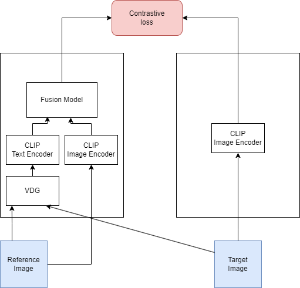

# Project Name

## Description

This project is a deep learning framework that utilizes a modified CLIP model for contrastive learning.

<p align="center">
  
</p>

## Installation

```bash
pip install -r requirements.txt
